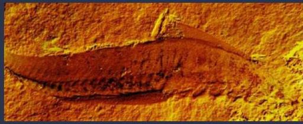
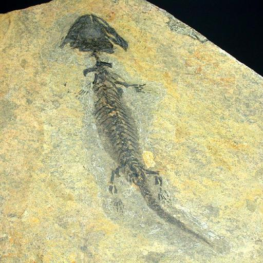
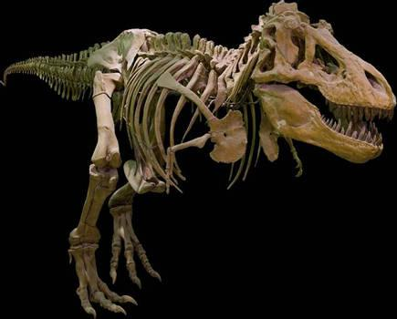

# Capstone project
## Introduction 
The goal of this project is to develop a system that can accurately identify, classify and recognise fossil images like dinosaurs or trace fossils.

Identifying fossils can be a time-consuming process that relies on expert knowledge of fossil morphology and can be challenging to identify due to their fragmented and degraded nature.

The main problem to address in this project is the development of a machine learning model capable of accurately recognising and classifying fossils based on their images.

## The data 
- Sources and context of the dataset: The dataset is a collection of fossil images obtained by using a web crawler to download fossil images from the Internet and automatically export the data into a structured dataset.
    - __reduced-FID__ dataset: I will use the reduced-FID with 60 thousand images and 50 category of fossils publish by <a href="https://zenodo.org/record/6333970">zenodo.org </a>. Links to download the [reduced-FID dataset](https://zenodo.org/record/6333970/files/reduced-FID.zip?download=1)
    - __FID__ dataset: This dataset is used to fill the gaps of the reduced-FID. Links to download the <a href="https://zenodo.org/record/6333970/files/FID.zip?download=1">FID dataset</a>. 
    - __fossil-vs-non-fossil__ dataset, I used to remove irrelevant images. [fossil-vs-non-fossil.zip](https://drive.google.com/file/d/1PDpBdpD7_4jHZIcRFQBYatoU4Jy9Dhj1/view?usp=sharing)   

- Samples of the entries, features, values: The dataset is a reduced version of the Fossil Image Dataset that contains 415 thousand images.

- Number of features and samples: The dataset contains 60 thousand RGB images 1200~ image for each 50 category of fossils.

- Encoding of the features: The images are stored in subfolder with each subfolder named according to the commune ancestor. 

- Quality of the data: the data is of high quality, with no missing images. However some images are not relevant or have some obstruction like text or humans.

- Images format: the images have the following format BMP, GIF, JPEG, PNG, TIFF.

- Below I will display a small sample of some images contained in the dataset. 

### agnath

### amphibian

### theropod

### Dependencies to install

>__imagehash__ is a package that needs to be installed on the environment: 
>- using conda: ``conda install -c conda-forge imagehash``
>- using pip: ``pip install ImageHash``

>__scikit-image 0.21.0__ is a package that needs to be installed on the environment: 
>- using pip: ``pip install scikit-image``

>__split-folders__ is a package that needs to be installed on the environment: 
>- using pip: ``pip install split-folders``

>__yellowbrick 1.5__ is a package that needs to be installed on the environment: 
>- using pip: ``pip install yellowbrick``

### Files:
1. ``Data exploration and cleaning.ipynb``
2. ``Remove-irrelevant-images.ipynb``
3. ``Fossil-classifier.ipynb``